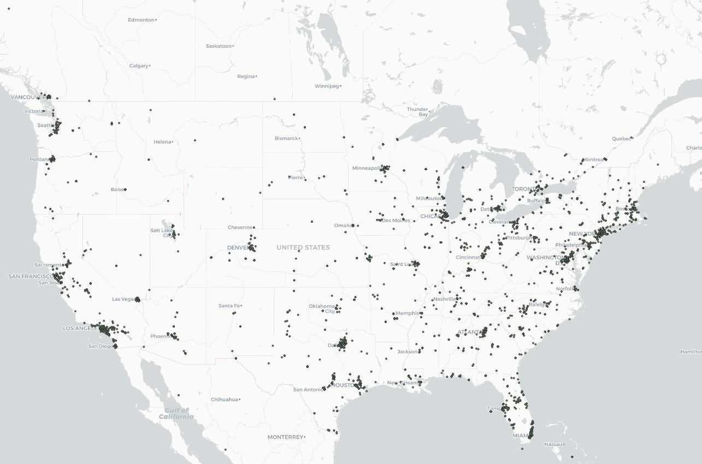
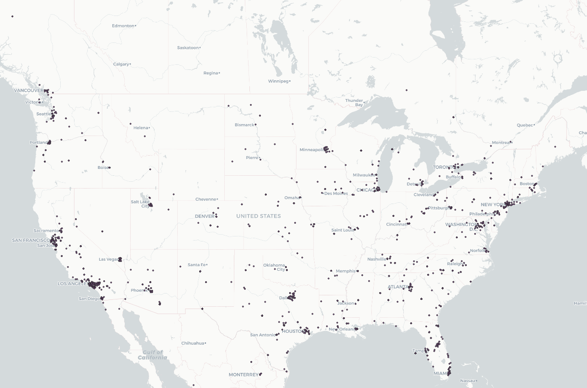
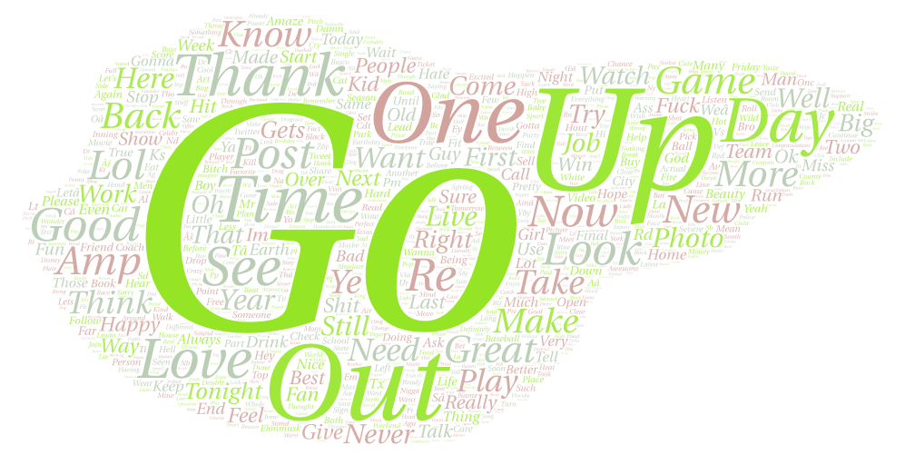
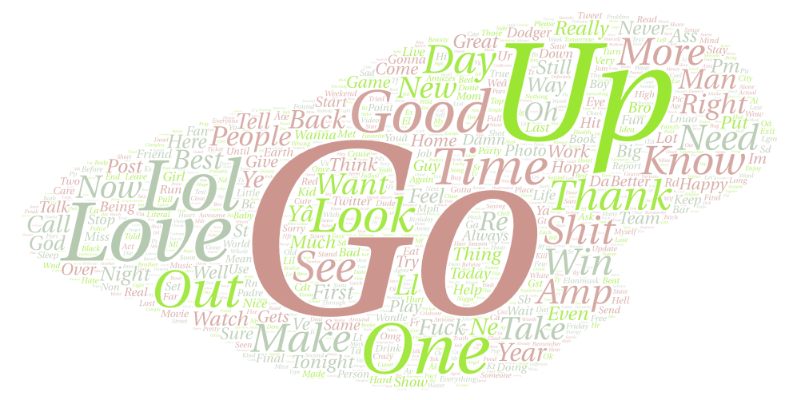

# GEOG 458 Lab 2: Geo-tagged tweet collection and visualization
In this lab I analyze and compare geo-tagged tweets by visualizing them on a map and word cloud. To collect data from the Twitter API I used an [API-based crawler](geosearch.ipynb) created by Professor Bo Zhao.

## Introduction
For my geo-tagged tweet data, I decided to compare two instances by the time period. For my time periods I chose 5:30pm and 10:00pm PDT. I wanted to make this comparison as it would be interesting to see how people's social media use varies by the time of day based on what they are doing. For example, 5:30pm is when a lot of working-class people commute back from work and are essentially busier so they it is expected to see less tweets around this time, at least in the west coast area. However, in the east coast this is 8:30pm which means that I would expect a lot of people to be using social media and twitter. 10:00pm PDT however is when many people have finished eating dinner and are enjoying their Friday evening doing leisure activities which can include using social media. However, on the east coast this is 1:00am which is when many people are sleeping or getting ready for bed and have put away their phones so tweets would be expected to have decreased. Since the US is so massive and has many time zones, it will be interesting to see how the geospatial patterns vary from coast to coast based on the time. Both data are taken from the same day, Friday (4/22/2022), as different days might add unwanted inconsistency.

## Comparing the mapped geography of geo-tagged tweets at different times (5:30pm vs 10:00pm)
### Mapped geography of tweets in the contiguous US at 5:30pm (4/22/2022)

### Mapped geography of tweets in the contiguous US at 10:00pm (4/22/2022)

When comparing the two maps we can clearly see the similarities in patterns and trends of the location of geo-tagged tweets in the US. As expected, they cluster mainly among urban areas with a large population of people. Some of the main clusters that can be seen are around large urban areas like New York, LA, Bay Area, Chicago, Dallas, Washington D.C., and so on. Surprisingly, the 5:30pm map seems to have more points and is slightly denser in the urban clusters on the west coast than the 10:00pm map. However, in general, the west coast area has only slightly less tweets based on dot density in the 10:00pm map versus 5:30pm. The most significant pattern difference can be seen the further east we go when the time approaches 1:00am and people are likely asleep and not using twitter. There is a large difference in geospatial patterns based on the dot density around the urban clusters which dramatically decreases, as expected at this late of an hour. Previously dense clusters in the 5:30pm map in areas like Boston, only have a few dots and little twitter activity in the 10:00pm map, which is 1:00am in Boston.

## Comparing visualized word clouds of geo-tagged tweets at different times (5:30pm vs 10:00pm)
### Word cloud of popular tweet words in the US at 5:30pm (4/22/2022)

### Word cloud of popular tweet words in the US at 10:00pm (4/22/2022)

These word clouds are quite intriguing to compare. One of the first things that stands out is that going from 5:30pm to 10:00pm we see the words "go" and "out" get significantly smaller which makes a lot of sense as more people go out around the evening than at night. We also see "day" get smaller and less frequent and words like "love" and "lol" get significantly bigger in the night time (10:00pm). They represent different contexts as the 5:30pm word cloud represents daytime and the evening, whereas 10:00pm represents general night time (excluding areas like Hawaii) and when people are getting ready for bed or sleeping. The difference in contexts is very evident as mentioned above, by words like "day" and "go" and "out". Certain words do stay the same frequency, like "time" or "one" as they are not very context heavy. Another word I found personally interesting was "game" since today there were 3 NBA games played around 4-7pm PDT in the evening and we can see "game" being a frequent word in the 5:30pm word cloud but nowhere to be seen in the 10:00pm word cloud.